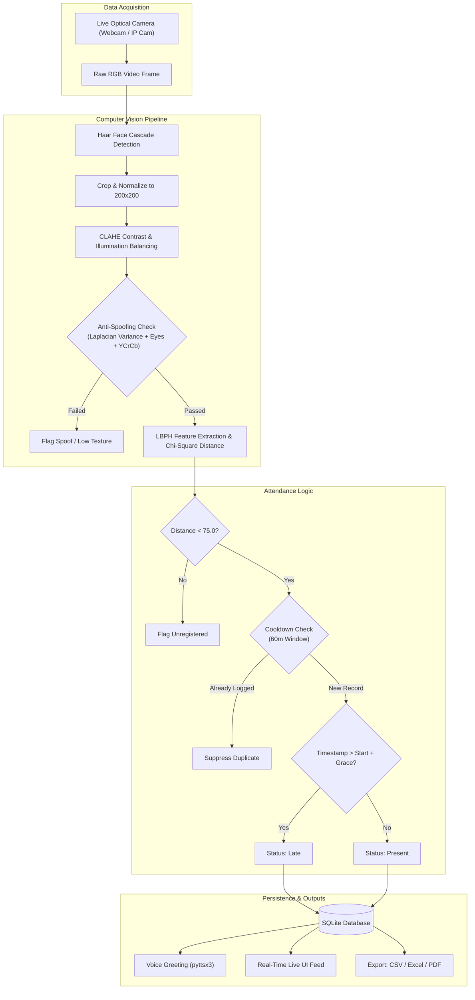

# 🎯 VisionAttend AI
### Automated Face Recognition Attendance Tracking System
*Final Year Engineering Project (B.E. / B.Tech / M.C.A. / B.C.A.) - Jan 2026*

---

## 📌 Executive Summary
**VisionAttend** is a production-ready, contactless biometric attendance management system built with Python, OpenCV, and Flask. It uses high-speed face detection (Haar Cascades with CLAHE illumination normalization) and Local Binary Patterns Histograms (LBPH) to automate attendance tracking in university lecture halls and laboratories in real time.

---

## ✨ Key System Features

- 🎥 **Real-Time Live Video Kiosk (30+ FPS)**: Low-latency MJPEG webcam streaming with dynamic bounding-box HUDs, student names, roll numbers, status badges, and confidence metrics.
- 🛡️ **Multimodal Anti-Spoofing & Liveness Detection**: Combines Laplacian focus variance analysis, ocular feature validation, and YCrCb skin chrominance clustering to reject printed photos and smartphone displays.
- ⏱️ **Punctuality & Duplicate Protection**:
  - Classifies attendance automatically into **Present** (On-Time) vs **Late** based on official lecture start time and grace periods.
  - In-memory cooldown locks prevent duplicate logs when students stand in front of the lens.
- 👥 **Biometric Enrollment Studio**: Interactive webcam capture wizard captures 30 normalized facial crops per student with guided poses, progress bar, and CLAHE preprocessing.
- 🧠 **AI Model Training Center**: One-click retraining of the LBPH recognizer with automated 80/20 train-test cross-validation, computing **Accuracy Score %**, **Precision**, **Recall**, **F1-Score**, and **Confusion Matrix**.
- 📊 **Multi-Format Institutional Reporting**:
  - **CSV Export** for spreadsheets.
  - **Styled Excel (.xlsx)** with auto-sized columns and status color coding via `openpyxl`.
  - **Official Academic PDF Attendance Sheets** with university headers and faculty/HOD signature sections via `reportlab`.
- 📈 **Executive Analytics & Defaulter Tracking**: Visual 7-day trend graphs (Chart.js) and automated identification of students violating the mandatory **75% University Attendance Threshold**.
- 🔊 **Voice Audio Feedback**: Background text-to-speech engine (`pyttsx3`) speaks personalized vocal confirmations ("Welcome Alex, CSE. Attendance verified").
- 🖥️ **Dual Operational Modes**:
  1. **Web Portal Mode**: Modern responsive web application (Tailwind CSS, dark mode).
  2. **Standalone Native OpenCV Desktop Mode**: Direct OpenCV window mode (`run_gui.py`) for offline academic viva demonstrations.

---

## 🏗️ System Architecture



---

## 🚀 Quick Start Guide (Windows)

### 1. Launch Web Portal (Recommended)
Double-click `run.bat` or run:
```powershell
cd E:\agy-cli\vision-attend
python app.py
```
Open your browser at: **`http://localhost:5000`**

### 2. Launch Standalone Native OpenCV Desktop Mode
Double-click `run_desktop.bat` or run:
```powershell
cd E:\agy-cli\vision-attend
python run_gui.py
```
**Desktop Controls**:
- `[Q]` or `[ESC]`: Quit
- `[S]`: Switch Active Course / Subject
- `[E]`: Enroll New Student (Webcam capture wizard)
- `[T]`: Retrain Recognition Classifier
- `[L]`: Toggle Anti-Spoofing Liveness On/Off

---

## 🔐 Default Credentials for Evaluators & Testing

| Role | Username / Login Key | Password | Purpose |
| :--- | :--- | :--- | :--- |
| **Administrator** | `admin` | `admin123` | Full governance, curriculum, enrollment & training |
| **Faculty / Teacher** | `T101` | `teacher123` | Start live attendance kiosk & export reports |
| **Student** | Student Roll No (e.g. `22CS01`) | Roll Number | Personal attendance %, 75% compliance tracker |

---

## 📁 Project Directory Structure

```
vision-attend/
├── app.py                      # Flask Web Application & REST API
├── run_gui.py                  # Standalone Native OpenCV Desktop GUI Kiosk
├── config.py                   # Central hyperparameters & directory mappings
├── requirements.txt            # Python dependencies
├── run.bat                     # Windows 1-click launcher for Web Portal
├── run_desktop.bat             # Windows 1-click launcher for Desktop Kiosk
│
├── core/
│   ├── database.py             # SQLite models, indices, auth & queries
│   ├── face_engine.py          # OpenCV Haar + CLAHE + LBPH Recognizer & cross-validation
│   ├── liveness_detector.py    # Laplacian focus variance, eye presence & skin chrominance
│   └── attendance_manager.py   # Cooldown protection, schedule rules, HUD rendering
│
├── services/
│   ├── export_service.py       # Excel (.xlsx), CSV, and ReportLab PDF generators
│   ├── stats_service.py        # 7-day trends, ratio computations & defaulters list
│   └── voice_service.py        # Multi-threaded pyttsx3 audio greetings
│
├── templates/                  # Modern Tailwind CSS HTML5 templates
│   ├── base.html               # Master layout with responsive sidebar & live clock
│   ├── login.html              # Multi-role authentication portal
│   ├── kiosk.html              # Real-time attendance kiosk with live feed & manual mark
│   ├── attendance.html         # Filterable attendance logs & export triggers
│   ├── students.html           # Student registry & enrollment modal
│   ├── student_profile.html    # Biometric capture studio & compliance history
│   ├── train.html              # AI model training center with accuracy metrics
│   ├── analytics.html          # Visual charts & 75% defaulters list
│   ├── student_portal.html     # Student individual dashboard & compliance warnings
│   ├── teachers.html           # Faculty onboarding catalog
│   ├── subjects.html           # Course & curriculum management
│   └── settings.html           # System hyperparameters & vision calibration
│
├── static/
│   ├── css/custom.css          # Sleek dark styling & animations
│   └── js/main.js              # Client-side scripts & toast auto-dismiss
│
├── dataset/                    # Enrolled students face crops organized by ID
├── models/                     # Serialized trainer.yml & evaluation.json
├── reports/                    # Generated PDF, Excel, and CSV export files
│
└── docs/
    ├── PROJECT_REPORT.md       # Comprehensive academic final year report
    └── VIVA_PREPARATION_GUIDE.md # 50+ Viva Voce questions & model examiner answers
```

---

## 🎓 How to Present to University Evaluators

1. **Start with the Problem & Motivation**: Explain the 10–15 minute instructional loss and proxy attendance issues in paper rosters and fingerprint bottleneck queues.
2. **Showcase the Role-Based Portals**:
   - Log in as **Admin** (`admin`/`admin123`) to show curriculum and faculty setup.
   - Enroll a student: Go to **Student Registry** $\rightarrow$ **Register New Student** $\rightarrow$ Click **"Capture 30 Face Crops"** (watch the live webcam capture 30 sample crops in seconds!).
   - Train the Model: Go to **AI Model Training** $\rightarrow$ Click **"Retrain Recognition Engine"** $\rightarrow$ Highlight the computed **Accuracy Score %** and **Confusion Matrix**.
3. **Demonstrate the Live Attendance Kiosk**:
   - Select Course $\rightarrow$ Look into the camera $\rightarrow$ Watch the green HUD appear, student name tagged with roll number and confidence %, and hear the vocal announcement: *"Welcome [Name], Attendance verified"*.
   - Stand in front of the camera again to prove **Anti-Duplicate Cooldown Protection** (*"Already marked recently"*).
4. **Demonstrate Anti-Spoofing**:
   - Hold up a smartphone with a photo or turn down the texture to show the anti-spoofing rejection indicator.
5. **Generate Institutional Reports**:
   - Go to **Attendance Logs** $\rightarrow$ Click **Printable PDF Sheet** to open a formal university attendance report complete with signature spaces for Faculty and Head of Department!
6. **Check Analytics & 75% Defaulter Warning**:
   - Open **Analytics & Charts** $\rightarrow$ View 7-day attendance trend line chart and inspect students falling below the mandatory 75% threshold.
   - Log in as that **Student** to show the red debarment warning alert.
7. **Offline Viva Backup**:
   - Run `run_desktop.bat` to demonstrate native OpenCV desktop mode if examiners request command-line/desktop execution!
