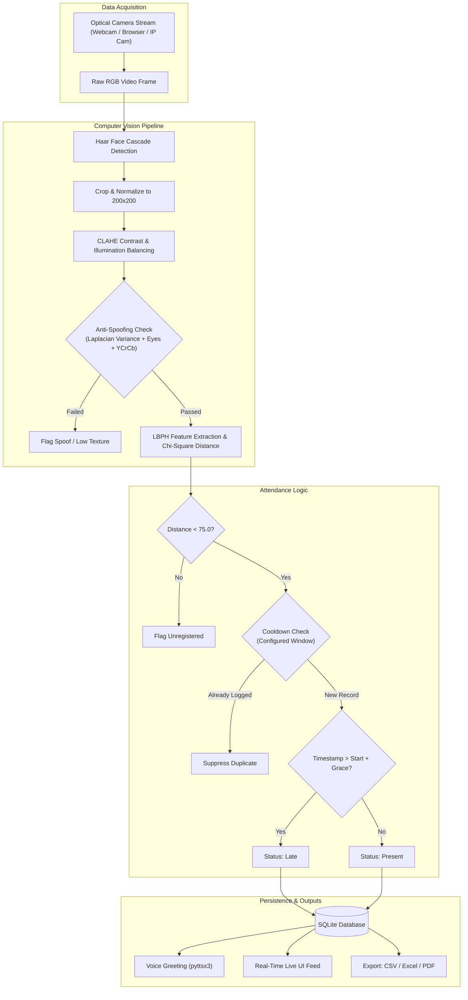

# 🎯 VisionAttend AI (Enterprise Edition)
### Contactless Biometric Facial Attendance & Liveness Verification System

[](https://codespaces.new/Darshan007-code/Vision-Attend)
[](LICENSE)
[](https://www.python.org/)
[](https://opencv.org/)
[](https://flask.palletsprojects.com/)
[](Dockerfile)

---

## 🌐 1-Click Instant Cloud Demo on GitHub

You can launch and test **VisionAttend AI** live directly inside **GitHub** with zero local installations:

[](https://codespaces.new/Darshan007-code/Vision-Attend)

> **How it works**:
> 1. Click **[Open in GitHub Codespaces](https://codespaces.new/Darshan007-code/Vision-Attend)** above (or press `,` on this repository).
> 2. GitHub automatically creates a dedicated cloud container, installs all system and Python dependencies, and launches the server.
> 3. GitHub forwards port `5000` and displays a notification to open the live web app in your browser!

---

## 📌 Executive Summary

**VisionAttend AI** is a production-grade, contactless biometric attendance management system engineered with Python, OpenCV, and Flask. It pairs high-speed face detection (Haar Cascades with Contrast Limited Adaptive Histogram Equalization - CLAHE) and Local Binary Patterns Histograms (LBPH) to automate attendance tracking in corporate environments, lecture halls, and facilities in real time.

The system incorporates **multimodal biological liveness detection** (Laplacian focus variance, Haar cascade ocular feature tracking, and YCrCb chrominance consistency) to actively block presentation attacks from printed photos and digital mobile displays.

---

## ✨ Key System Features

- 🎥 **Real-Time Live Video Kiosk (30+ FPS)**: Low-latency MJPEG video streaming with dynamic bounding-box HUDs, individual names, identification codes, status badges, and confidence metrics.
- 🌐 **Client-Side Browser Webcam Streaming**: Direct WebRTC/HTML5 canvas frame processing (`/api/process_browser_frame`) enabling users on any device, phone, or laptop to test live face recognition directly through their browser—even on cloud servers without physical webcams.
- 🛡️ **Biological Anti-Spoofing & Liveness Verification**: Combines Laplacian focus variance, Haar cascade eye action validation, and YCrCb skin chrominance clustering to reject static photos and video replays.
- ⏱️ **Punctuality & Duplicate Protection**:
  - Automatically classifies attendance into **Present** (On-Time) vs **Late** based on configured schedule start times and grace periods.
  - In-memory cooldown locks prevent duplicate attendance logs when individuals remain in front of the lens.
- 👥 **Biometric Enrollment Studio**: Interactive webcam capture wizard captures 30 normalized facial crops per individual with guided poses, progress bar, and CLAHE preprocessing.
- 🧠 **AI Model Training Center**: One-click retraining of the LBPH recognizer with automated 80/20 train-test cross-validation, computing **Accuracy Score %**, **Precision**, **Recall**, **F1-Score**, and **Confusion Matrix**.
- 📊 **Multi-Format Institutional Reporting**:
  - **CSV Export** for analytics and spreadsheet pipelines.
  - **Styled Excel (.xlsx)** with auto-sized columns and status color coding via `openpyxl`.
  - **Official Attendance PDF Sheets** with institutional branding and authorization/sign-off sections via `reportlab`.
- 📈 **Executive Analytics & Defaulter Tracking**: Visual 7-day trend graphs (Chart.js) and automated identification of attendees falling below the **75% Compliance Threshold**.
- 🔊 **Voice Audio Feedback**: Background text-to-speech engine (`pyttsx3`) speaks personalized vocal confirmations ("Welcome Alex, Attendance verified").
- 🖥️ **Dual Operational Modes**:
  1. **Web Portal Mode**: Responsive web application (Tailwind CSS, dark mode).
  2. **Standalone Native OpenCV Desktop Mode**: Direct OpenCV window mode (`run_gui.py`) for dedicated hardware appliances.

---

## 🏗️ System Architecture



---

## 🚀 Quick Start Guide

### Option 1: 1-Click Cloud Run on GitHub Codespaces
Click the badge below to run the full environment on GitHub's cloud runtime:

[](https://codespaces.new/Darshan007-code/Vision-Attend)

### Option 2: Local Setup (Windows / Linux / macOS)

1. **Clone the Repository**:
   ```bash
   git clone https://github.com/Darshan007-code/Vision-Attend.git
   cd Vision-Attend
   ```

2. **Create and Activate a Virtual Environment**:
   ```bash
   python -m venv venv
   # Windows:
   .\venv\Scripts\activate
   # Linux / macOS:
   source venv/bin/activate
   ```

3. **Install Dependencies**:
   ```bash
   pip install -r requirements.txt
   ```

4. **Launch the Web Application**:
   ```bash
   python app.py
   ```
   Open your browser at: **`http://localhost:5000`**

### Option 3: Docker Deployment

```bash
docker build -t vision-attend .
docker run -p 5000:7860 vision-attend
```
Access the application at **`http://localhost:5000`**.

---

## 🔐 Role-Based Access Control

The platform provides multi-tier role-based authentication:

| Role | Primary Functions | Access Scope |
| :--- | :--- | :--- |
| **Administrator** | Full governance, department setup, biometric enrollment & AI model training | System Configuration, User Management, AI Center, Analytics |
| **Faculty / Manager** | Live attendance kiosk operations, manual overrides, and report exports | Kiosk Station, Attendance Records, CSV/Excel/PDF Exports |
| **Attendee / Student** | Personal attendance tracking, subject-wise statistics, and compliance status | Personal Dashboard, Attendance History, Debarment Alerts |

---

## 📁 Project Directory Structure

```
vision-attend/
├── app.py                      # Flask Web Application & REST API
├── run_gui.py                  # Standalone Native OpenCV Desktop GUI Kiosk
├── config.py                   # Central hyperparameters & directory mappings
├── requirements.txt            # Python dependencies
├── Dockerfile                  # Production container configuration
├── Procfile                    # Cloud platform process declaration
├── .devcontainer/              # 1-Click GitHub Codespaces configuration
│   └── devcontainer.json
│
├── core/
│   ├── database.py             # SQLite models, schema, auth & queries
│   ├── face_engine.py          # OpenCV Haar + CLAHE + LBPH Recognizer & cross-validation
│   ├── liveness_detector.py    # Laplacian variance, eye tracking & skin chrominance
│   └── attendance_manager.py   # Cooldown protection, schedule rules, HUD rendering
│
├── services/
│   ├── export_service.py       # Excel (.xlsx), CSV, and ReportLab PDF generators
│   ├── stats_service.py        # 7-day trends, ratio computations & defaulters list
│   └── voice_service.py        # Multi-threaded audio greetings
│
├── templates/                  # Modern Tailwind CSS HTML5 templates
│   ├── base.html               # Master layout with responsive sidebar & live clock
│   ├── login.html              # Multi-role authentication portal
│   ├── kiosk.html              # Real-time attendance kiosk (Server + Browser Webcam)
│   ├── attendance.html         # Filterable attendance logs & export triggers
│   ├── students.html           # Student registry & enrollment modal
│   ├── student_profile.html    # Biometric capture studio & compliance history
│   ├── train.html              # AI model training center with accuracy metrics
│   ├── analytics.html          # Visual charts & 75% defaulters list
│   ├── student_portal.html     # Individual dashboard & compliance warnings
│   ├── teachers.html           # Faculty onboarding catalog
│   ├── subjects.html           # Course & curriculum management
│   └── settings.html           # System hyperparameters & vision calibration
│
├── static/
│   ├── css/custom.css          # Sleek dark styling & animations
│   └── js/main.js              # Client-side scripts & toast notifications
│
├── dataset/                    # Enrolled biometric face crops organized by ID
├── models/                     # Serialized trainer.yml & evaluation.json
├── reports/                    # Generated PDF, Excel, and CSV export files
│
└── docs/
    ├── PROJECT_REPORT.md       # Technical architecture specification
    └── VIVA_PREPARATION_GUIDE.md # Technical architecture & system design guide
```

---

## 📄 License

This project is licensed under the MIT License - see the [LICENSE](LICENSE) file for details.
